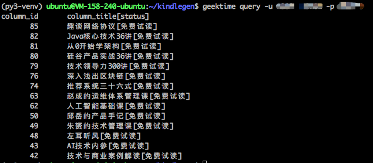

# 把极客时间专栏装进Kindle

[](https://travis-ci.org/jachinlin/geektime_ebook_maker)
[](https://codecov.io/gh/jachinlin/geektime_ebook_maker)

极客时间专栏文章的质量都是非常高的，比如耗子哥的《左耳听风》、朱赟的《朱赟的技术管理课》和王天一的《人工智能基础课》，都是我非常喜欢的专栏。这些专栏深入浅出，将知识和经验传授于读者，都是值得多次阅读的。

然而，每当空闲时间时，都需要掏出手机才能阅读专栏文章，这在某种情况下是很不便的，尤其坐地铁且没有网络时。作为一个kindle党，最好的解决方案就是kindle电子书。于是有了这个项目

>[把极客时间装进Kindle](https://github.com/jachinlin/geektime_ebook_maker)

这个项目包括四个部分

1. kindle_maker
2. mini_spider
3. geektime_spider
4. geektime_ebook


`kindle_maker`是一个mobi电子书制作工具。用户只需要提供制作电子书的html文件，和一个包含目录信息的toc.md文件，kindle_maker即可制作出一本精美的kindle电子书。

这部分已拎出来放在单独的项目里，具体使用方式见该项目文档。

[kindle_maker](https://github.com/jachinlin/kindle_maker)

`mini_spider`是一个小型多线程爬虫框架，用户只需要为每个`url pattern`写一个`parse`解析函数和一个`save`存储函数就可以了。

`geektime_spider`则负责抓取极客时间的专栏文章，并保存到sqlite3中，使用的工具就是上面的mini_spider。

`geektime_ebook`主要将 geektime_spider 抓取到数据转化为 kindle_maker 需要的源文件。

最后，我们使用 kindle_maker 将上面的源文件生成电子书。


### 依赖

[requests](http://www.python-requests.org/en/master/)

[Jinja2](http://jinja.pocoo.org/)

[kindle_maker](https://github.com/jachinlin/kindle_maker)

[Kindlegen](https://www.amazon.com/gp/feature.html?ie=UTF8&docId=1000765211)

### 安装

#### 虚拟环境 virtualenv
```
cd ~
virtualenv -p python3 py3-venv
source py3-venv/bin/activate
```

#### 代码

```
pip install -U git+https://github.com/jachinlin/geektime_ebook_maker.git
```

#### 安装kindlegen

* For Linux:

```
cd ~
mkdir kindlegen
cd kindlegen
wget http://kindlegen.s3.amazonaws.com/kindlegen_linux_2.6_i386_v2_9.tar.gz
tar xvfz kindlegen_linux_2.6_i386_v2_9.tar.gz
cp ~/kindlegen/kindlegen ~/py3-venv/bin/
```

* For macOS:

```
brew install homebrew/cask/kindlegen
```


### 运行

#### 查看专栏列表

```
geektime query -u <your register phone> -p <password>
```

`-u` 后边为你在极客时间上的注册手机号，`-p` 后为密码。



#### 制作电子书

```
geektime ebook -c <column_id> -u <your register phone> -p <password>
```

`-c`后为专栏ID，可以从上面的操作中获得；`-u` 后边为你在极客时间上的注册手机号；`-p` 后为密码。
对于非中国的手机号, 可以通过 `--area` 指定国家区号, 如 `--area 1` 表明是美国手机号。


### 效果

#### 左耳听风


### Todo list

- [ ] support mathjax
- [ ] MP3 and MP4
- [ ] ...


-----
注意：请保护版权，不传播该电子书！
