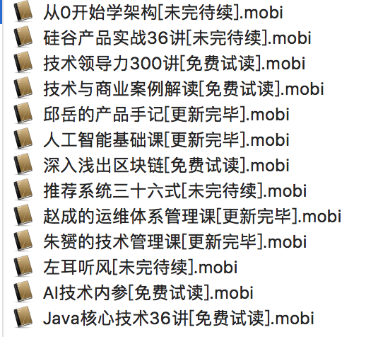

# 把极客时间专栏装进Kindle

极客时间专栏文章的质量都是非常高的，比如耗子哥的《左耳听风》、朱赟的《朱赟的技术管理课》和王天一的《人工智能基础课》，都是我非常喜欢的专栏。这些专栏深入浅出，将知识和经验传授于读者，都是值得多次阅读的。

然而，每当空闲时间时，都需要掏出手机才能阅读专栏文章，这在某种情况下是很不便的，尤其坐地铁且没有网络时。作为一个kindle党，最好的解决方案就是kindle电子书。于是有了这个项目
>[把极客时间装进Kindle](https://github.com/jachinlin/geektime_ebook_maker)

这个项目包括四个部分
1. mini_spider
2. ebook_maker
3. geektime_spider
4. geektime_ebook

mini_spider是一个小型多线程爬虫框架，用户只需要为每个url pattern 写一个parse解析函数和一个save存储函数就可以了。

ebook_maker是一个mobi电子书制作工具。用户只需要提供制作电子书的html文件，和一个包含目录信息的toc.md文件，使用ebook_maker 即可制作出一本精美的kindle电子书。

这两部分已拎出来放在单独的两个项目里，具体使用方式见各自文档。

[mini_spider](https://github.com/jachinlin/mini_spider)

[ebook_maker](https://github.com/jachinlin/ebook_maker)

geektime_spider则负责抓取极客时间的专栏文章，并保存到sqlite3中，使用的工具就是上面的mini_spider。

geektime_ebook主要将geektime_ebook抓取到数据转化为ebook_maker需要的源文件。

最后，我们使用ebook_maker将上面的源文件生成电子书。


### 依赖

[requests](http://www.python-requests.org/en/master/)

[Jinja2](http://jinja.pocoo.org/)

[Kindlegen](https://www.amazon.com/gp/feature.html?ie=UTF8&docId=1000765211)

### 安装

code

```
https://github.com/jachinlin/geektime_ebook_maker.git
```

virtualenv
```
cd geektime_ebook_maker
virtualenv -p python3 .venv
source .venv/bin/activate
```

requirements

```
pip install -r requirements.txt
```

kindlegen

```
wget http://kindlegen.s3.amazonaws.com/kindlegen_linux_2.6_i386_v2_9.tar.gz
tar xvfz kindlegen_linux_2.6_i386_v2_9.tar.gz
cp ~/KindleGen/kindlegen .venv/bin

```

### 运行

```
ACCOUNT=<your register phone> PASSWORD=<password here> python run.py
```


### 结果



-----
注意：请保护版权，不传播该电子书！
